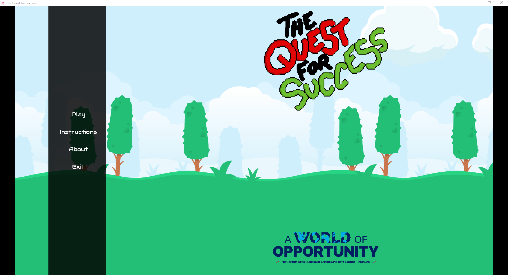

# The Quest for Success

## Gameplay

*The Quest for Success* was designed from the ground up to be an intuitive and fun experience. It features 
multiple puzzles and takes the player on a journey from the perspective of an FBLA member.

## Topic Correlation

This game is based around the adventure of an FBLA member on his journey to complete all the requirements of the business
achievement award. Splitting education, progress, and service into each of their own mini-games for each tier of the award.
This allows the player to understand the basic requirements of each tier by interacting directly with the objectives.

A scoreboard is available, and the score is visible at all times during the game. Interactive hotkeys will be shown on 
the screen when needed. The game can be played multiple times to discover multiple endings.

## Features
- Keyboard and mouse compatibility
- A variety of original art
- 4 separate stages, each with three levels with increasing difficulty
- Awards with power-ups for the player
- A variety of separate mini-games.
- Interactive dialogue
- Enemies, lives, coins, and an overall score system.
- An advanced puzzle platformer
- Instructions page included on a menu page. 

### Controls

| Type | Key |
|------|-----|
| Move Left | *Left Arrow* |
| Move Up | *Up Arrow* |
| Move Down | *Down Arrow* |
| Move Right | *Right Arrow* |
| Use | *E* |
| Quit Game | *Escape* |

## Run Instructions

Launch `quest.exe` in the [`game`](game) directory.

## Development Instructions
For more technical information, read `technical_readme.md`. Also view [javadocs (kDocs)](javadoc/index.html) in the 
`javadoc` folder. Code is commented and should be fairly easy to understand. Advanced game rules are also featured
within the source code.

### Running a Development Copy
1. Open the `src` directory with an editor of your choice
2. Make changes
3. Run `gradle desktop:run` to compile and run the updated game
4. View the [license](./LICENSE.txt)

### Editing Maps
1. Install [Tiled](https://www.mapeditor.org/)
2. Open a map in `core/assets/assets/maps` with Tiled
3. Make changes to the map
4. Save the map
5. Run it following the instructions above

### Technologies Used
 * [IntelliJ IDEA](https://www.jetbrains.com/idea/) - used to efficiently write code
 * [Adobe Illustrator](https://www.adobe.com/products/illustrator.html) - used to create icons and images
 * [Gradle](https://gradle.org/) - used to automate builds and manage dependencies
 * [Git SCM](https://git-scm.org) - used for version control
 * [Kotlin](http://kotlinlang.org/) - used to write readable and ergonomic code
 * [Tiled](https://www.mapeditor.org/) - used to create flexible and reusable levels
 * [Aseprite](https://www.aseprite.org/) - used to design art in a retro pixelart style

### Dependencies Used
 * [Kotlin](http://kotlinlang.org/) - used for null-safety and language features
 * [libgdx](https://libgdx.badlogicgames.com/) - used as a game programming and graphics framework
 * [Artemis-ODB](https://github.com/junkdog/artemis-odb/) - used as a entity-component-system for organizing and managing entities

## Screenshots

